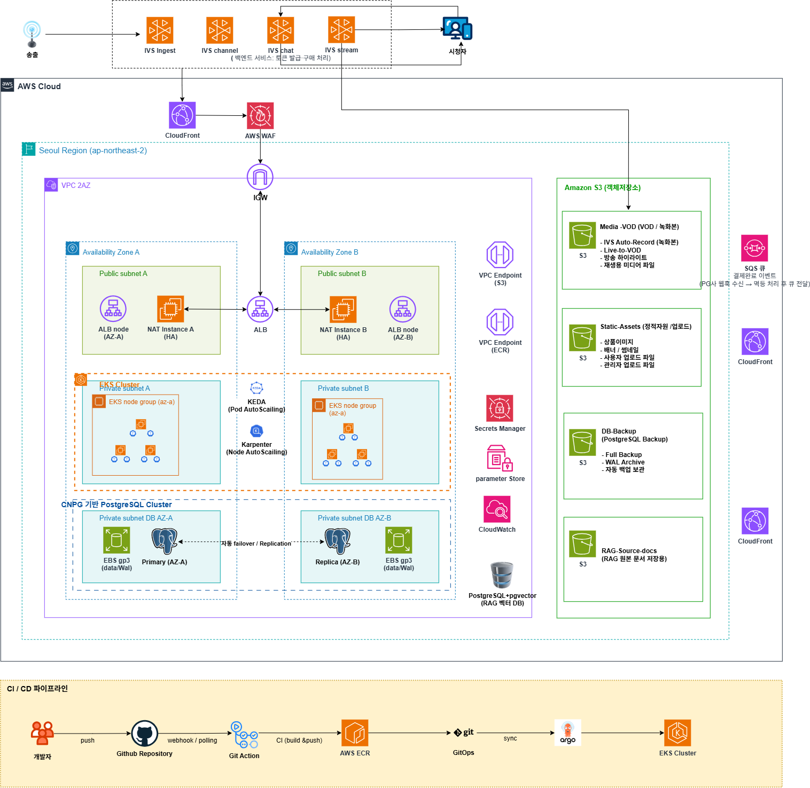

# Fundit-Infra

> Fundit: 라이브 커머스형 리워드 펀딩 서비스의 Terraform(IaC) 레포
> Org `KT-Cloud-Tech-Up-team6` / 팀명 육하원칙 / 리전 `ap-northeast-2`(서울) / 담당 이미선(k8s 운영·인프라 운영)

## 목차

- [1. 무엇을 만드는 레포인가](#1-무엇을-만드는-레포인가)
- [2. 아키텍처](#2-아키텍처)
- [3. 레포 구조](#3-레포-구조)
- [4. 설계 원칙](#4-설계-원칙)
- [5. 협업 규약](#5-협업-규약)
- [6. 네이밍 (요약)](#6-네이밍-요약)
- [7. tfstate 관리 (S3 백엔드)](#7-tfstate-관리-s3-백엔드)
- [8. 관련 문서](#8-관련-문서)

## 1. 무엇을 만드는 레포인가

Fundit 서비스가 올라갈 AWS 인프라(VPC, EKS, DB, 스토리지, CI 연동 자원)를 Terraform으로 만든다.

- 애플리케이션 코드는 `Fundit-backend`(Spring Boot MSA), `Fundit-FE`(Next.js)에 있다.
- 쿠버네티스 배포 매니페스트(Karpenter NodePool, KEDA ScaledObject, HPA, CNPG Cluster 스펙 등)는 `Fundit-GitOps`가 ArgoCD로 관리한다.
- 이 레포는 클러스터·네트워크·DB까지만 만든다. 애드온 컨트롤러 설치(ArgoCD, Karpenter, KEDA, CNPG 오퍼레이터)는 이 레포 소관이고, 그 컨트롤러가 참조하는 정책값은 `Fundit-GitOps` 소관이다.
- `terraform/envs/bootstrap/`은 tfstate S3 버킷과 ECR을 만든다. dev/staging/prod가 공용으로 쓰고, 한 번만 적용한다.
- `packer/`는 dev EC2용 AMI(Docker, AWS CLI 설치됨)를 빌드한다. AMI 이름이 `fundit-dev-`로 고정되어 있어 지금은 dev 전용이다.

## 2. 아키텍처



요청 흐름은 다음과 같다. (괄호는 담당 모듈 또는 소관, 위 다이어그램 기준)

1. **방송 송출** — 방송자 → IVS(Ingest/channel/chat/stream)가 스트림을 받는다. (IVS 프로비저닝은 Fundit-Infra 소관 아님)
2. **정적 웹·API 진입** — 시청자 → CloudFront → WAF → ALB(퍼블릭 서브넷, 2AZ) `(cloudfront-waf, alb)`
3. **백엔드 처리** — ALB → EKS 클러스터(프라이빗 서브넷, 2AZ) `(eks)`
4. **오토스케일링** — Karpenter가 노드를, KEDA가 파드를 늘린다. 컨트롤러 설치는 이 레포, 스케일 정책값은 `Fundit-GitOps` `(eks · GitOps)`
5. **데이터 저장** — CNPG 오퍼레이터가 EKS 안에 PostgreSQL Primary/Replica(자동 failover)를 띄운다. 오퍼레이터 설치는 이 레포, Cluster 스펙은 `Fundit-GitOps` `(eks · GitOps)`
6. **결제 이벤트** — PG사 웹훅 → SQS 큐 → 멱등 처리 후 백엔드로 전달 `(sqs)`
7. **오브젝트 저장** — Media-VOD, Static-Assets, DB-Backup을 S3에 저장 `(s3)`
8. **사설 통신** — EKS에서 S3·ECR로 나가는 트래픽은 NAT 대신 VPC Endpoint를 거친다 `(vpc-endpoints)`
9. **CI/CD** — 개발자 push → GitHub Actions → ECR(`ecr`) → ArgoCD가 `Fundit-GitOps`를 보고 EKS에 배포
10. **RAG(AI 검색)** — RAG-Source-docs(S3)와 pgvector DB는 AI팀 레포(`funding-story-ai` 등) 소관이다. 지금은 PoC 단계라 Fundit-Infra가 만들지 않는다.

모듈별 구현 상태는 이슈 트래커를 따른다. 지금은 `vpc`, `security-groups`, `ec2`, `ecr`, `s3`만 코드가 있고 나머지(`nat-instance`, `vpc-endpoints`, `alb`, `cloudfront-waf`, `route53-acm`, `eks`, `sqs`)는 빈 모듈이다.

## 3. 레포 구조

| 레포 | 배포 방식 | 소관 |
|---|---|---|
| `Fundit-Infra`(이 레포) | `terraform apply` | 인프라, Ansible |
| `Fundit-backend` | CI 빌드 후 ECR push | 백엔드 앱(Spring Boot MSA) |
| `Fundit-FE` | CI 빌드 후 ECR push | 프론트엔드(Next.js) |
| `Fundit-GitOps` | ArgoCD가 pull(GitOps) | 배포 매니페스트, 클러스터 애드온 정책값 |
| `funding-story-ai`, `live-commerce-copilot-mvp`(`-mvp1`) | — | AI팀 소관 |

이 레포 내부:

```
Fundit-Infra/
├── terraform/
│   ├── envs/
│   │   ├── bootstrap/          # tfstate S3, ECR (공용)
│   │   ├── dev/{01-network,02-gateway,03-compute}
│   │   ├── staging/{01-network,02-gateway,03-compute}
│   │   └── prod/{01-network,02-gateway,03-compute}
│   └── modules/
│       ├── vpc, security-groups, nat-instance, vpc-endpoints
│       ├── alb, cloudfront-waf, route53-acm
│       ├── ec2, eks, ecr, s3, sqs
├── packer/         # dev EC2용 Docker AMI 빌드
├── ansible/
├── .github/ISSUE_TEMPLATE/
└── README.md
```

환경은 브랜치가 아니라 폴더로 나뉜다. dev에서 최소 구성으로 먼저 검증한 모듈을 staging으로 옮겨 prod에 가까운 규모로 다시 확인하고, 안정화되면 prod로 옮긴다. 모듈 코드는 그대로 두고 변수값만 바꾼다.

## 4. 설계 원칙

- Karpenter, KEDA, CNPG, ArgoCD는 컨트롤러 설치까지만 이 레포가 하고, 실제 정책값(NodePool, ScaledObject, Cluster 스펙)은 `Fundit-GitOps`에 둔다. 운영 중 자주 바뀌는 값을 인프라 코드와 분리하기 위해서다.
- `Fundit-backend`가 API Gateway(`gateway-service`, Spring Cloud Gateway)로 서비스 간 라우팅을 처리하므로, 쿠버네티스 Ingress에 서비스별 경로 규칙을 따로 두지 않는다.
- NAT Instance를 쓰는 만큼, EKS에서 S3·ECR로 나가는 트래픽은 VPC Endpoint로 NAT를 우회한다.

## 5. 협업 규약

### 이슈

템플릿 4종을 쓴다. 제목은 템플릿이 지정한 접두어를 그대로 쓴다.

| 템플릿 | 제목 접두어 |
|---|---|
| Bug Report | `[Bug]: ` |
| Feature Request | `[Feature]: ` |
| Task / Chore | `[Task]: ` |
| Change Request | `[Change]: ` |

### 브랜치

`main` 하나만 유지한다. 작업은 feature 브랜치에서 하고 PR로 `main`에 합친다. `main`에 직접 커밋하지 않는다.

형식: `type/#이슈번호-설명` (예 `feat/#12-eks-cluster`)

| type | 용도 |
|---|---|
| `feat` | 새로운 기능·인프라 추가 |
| `fix` | 오류 수정 |
| `refactor` | 기능 변경 없이 구조 개선 |
| `docs` | 문서 작업 |

### 커밋

형식: `type: 설명`(콜론 뒤 띄어쓰기). type은 `feat`/`fix`/`chore`/`docs`/`refactor`

### PR

형식: `[type #이슈번호] 제목` (예 `[feat #12] EKS 클러스터 모듈 추가`)

- 관련 이슈 번호를 반드시 포함한다. 제목의 `#이슈번호`로 표시하거나, 본문에 `Closes #이슈번호`를 적는다.
- 본문에 변경 이유와 적용 대상 환경(dev/staging/prod)을 적는다.

### 코드 원칙

- 변경점은 최소로 한다.
- 참조할 모듈이 아직 없으면 빈 문자열 `""`을 쓰고, 실제 참조는 주석으로 남긴다.
- apply 시점에 알 수 없는 값에 `for_each`를 걸지 않는다.
- 주석은 왜 그렇게 했는지만 쓴다.

### 네이밍 변경

이름을 바꿀 때는 코드보다 `docs/네이밍규약서.md`를 먼저 고치고 팀에 공유한다.

## 6. 네이밍 (요약)

```
fundit-<environment>-<리소스종류>[-<식별자>]
```

예) `fundit-dev-vpc`, `fundit-tfstate-team6`

- 뿌리 변수: `project_name=fundit`, `environment`(`dev`/`staging`/`prod`), `aws_region=ap-northeast-2`
- 예외: PR #16에서 만든 VPC·서브넷·보안그룹·EC2는 `Fundit-dev-*`(대문자 시작)로 이미 적용되어 이름을 바꾸지 않는다. 그 뒤로 새로 만드는 리소스는 소문자로 적용한다

리소스 이름 전체, 서비스별 DB 네이밍, 태그 규약은 [`docs/네이밍규약서.md`](./docs/네이밍규약서.md)에 있다. 여기 요약과 다르면 규약서가 맞다.

## 7. tfstate 관리 (S3 백엔드)

tfstate는 `fundit-tfstate-team6` 버킷에 모으고, `key` 경로로 부트스트랩과 환경을 구분한다. 잠금은 DynamoDB가 아니라 S3 Native Lock(`use_lockfile = true`)을 쓴다. 리전은 전부 `ap-northeast-2`. apply는 한 번에 한 명만 하고, 작업 전 팀 채널에 알린다.

| 대상 | key 경로 | 비고 |
|---|---|---|
| bootstrap | `bootstrap/terraform.tfstate` | tfstate 버킷·ECR 생성 |
| dev/01-network | `dev/network/terraform.tfstate` | |
| dev/02-gateway | — | backend.tf 아직 없음 |
| dev/03-compute | `dev/compute/terraform.tfstate` | |
| staging/* | — | backend.tf 아직 없음 |
| prod/* | — | backend.tf 아직 없음 |

### 민감 파일 관리 (.gitignore)

아래 항목은 로컬에만 두고 커밋하지 않는다.

```gitignore
**/.terraform/*
*.tfstate
*.tfstate.*
crash.log
crash.*.log
*.tfvars
*.tfvars.json
*.auto.tfvars
*.auto.tfvars.json
override.tf
override.tf.json
*_override.tf
*_override.tf.json
.terraformrc
terraform.rc
.DS_Store
Thumbs.db
*.retry
```

`.tfvars`는 전부 ignore 대상이라 환경별 변수값은 커밋되지 않는다.

## 8. 관련 문서

- [`docs/네이밍규약서.md`](./docs/네이밍규약서.md) 리소스 이름·태그·서비스 계약 전체
