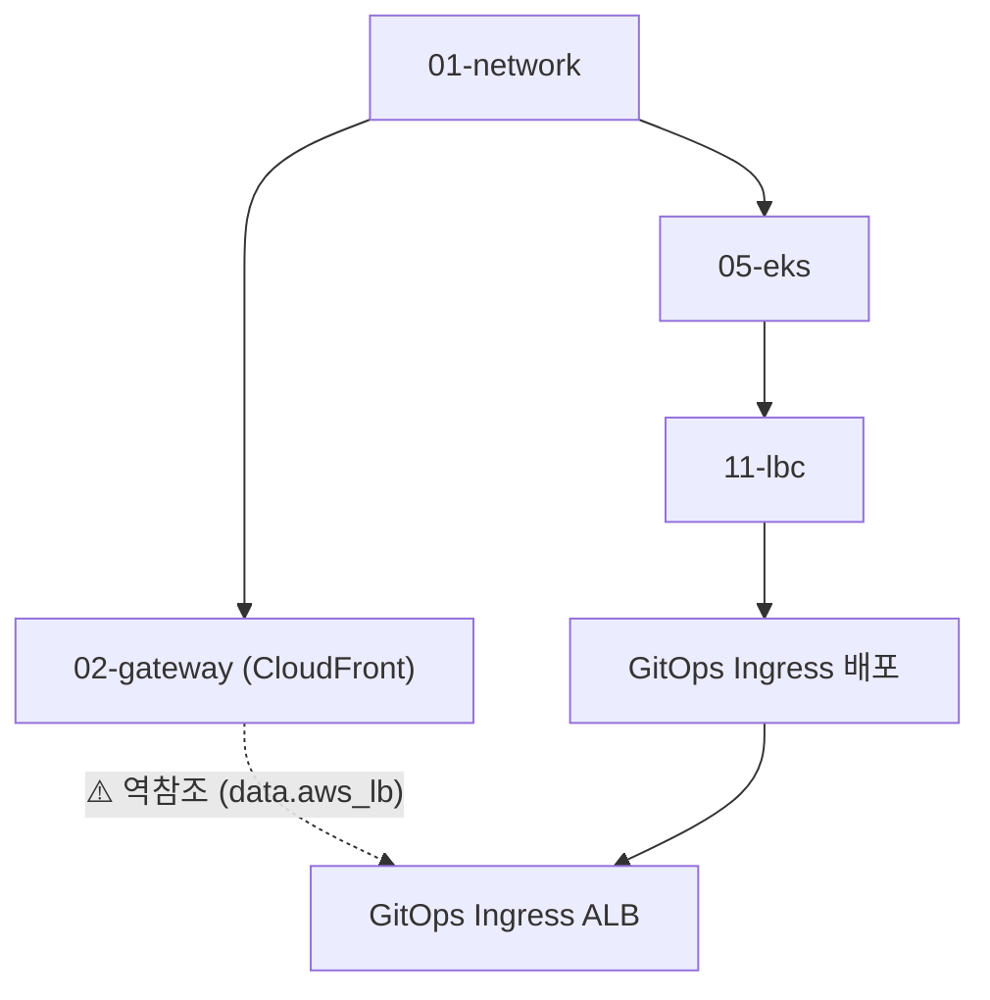

# 02-gateway 레이어 (CloudFront, Route53, WAF)

## 📌 개요
`02-gateway` 레이어는 FundIt 서비스의 글로벌 진입점(CloudFront CDN), 도메인/DNS(Route53), SSL 인증서(ACM 와일드카드) 및 웹 방화벽(WAF)을 관리합니다.

---

## ⚠️ 배포 순서 및 전제조건 (Prerequisites)

1. **EKS Ingress ALB 사전 프로비저닝 (GitOps 의존성)**
   - `02-gateway/data.tf`의 `data.aws_lb.eks_alb`는 Terraform이 아닌 **GitOps(EKS Ingress + AWS Load Balancer Controller)**에 의해 생성된 ALB를 태그(`ingress.k8s.aws/stack: fundit-alb`)로 조회합니다.
   - 따라서 **EKS 클러스터 및 Ingress 리소스가 먼저 배포되어 ALB가 AWS 상에 프로비저닝된 상태에서 `02-gateway`를 Apply**해야 합니다.

2. **Route53 Hosted Zone**
   - 도메인(`infrastudy.store`)의 Route53 퍼블릭 호스팅 영역이 사전 등록되어 있어야 합니다.

3. **ACM SSL 와일드카드 인증서**
   - `infrastudy.store` 및 `*.infrastudy.store` 와일드카드 SAN을 포함하여 CloudFront용으로 `us-east-1` 리전에 생성 및 DNS 자동 검증됩니다.

---

## 🔍 아키텍처 기술 부채 및 구조적 한계 분석: 레이어 역전 (Layer Inversion)

### 1. 문제의 본질: "2번 레이어가 7번 리소스를 기다리는 모순"
본 인프라 파이프라인의 레이어 번호 체계상 `02-gateway`는 `05-eks`, `11-load-balancer-controller`, 그리고 `GitOps Ingress`보다 앞서 실행되도록 설계되어 있습니다.

* **발생 원인 (히스토리):**
  - 초기 인프라 설계 시에는 `02-gateway`의 CloudFront가 `03-compute`의 단일 EC2 인스턴스를 원본(Origin)으로 바라보았기 때문에 번호 체계상 순차 배포에 문제가 없었습니다.
  - 그러나 서비스 컨테이너화 및 MSA 전환에 따라 오리진 대상이 **EKS Ingress ALB**로 변경되면서, 하위 레이어가 상위 레이어의 최종 결과물을 거꾸로 참조하는 **순환 의존성(Circular Dependency / Layer Inversion)**이 발생했습니다.

### 2. 신규 환경 구축(Greenfield Deployment) 시의 리스크
* **현재 상태:** 기존에 EKS 클러스터와 Ingress ALB가 이미 AWS 상에 생성되어 있으므로 `data` 조회가 성공하여 정상 배포됩니다.
* **잠재적 위험:** 만약 새로운 AWS 계정에 인프라를 0부터 순차적으로 프로비저닝할 경우, `02-gateway` 실행 시점에 EKS ALB가 존재하지 않아 **`data.aws_lb.eks_alb` 조회 실패로 파이프라인이 중단**됩니다.

---

## 🛠️ 장기적 근본 해결 방안 (리팩토링 로드맵)

향후 인프라 고도화 시 다음 두 가지 방안 중 하나로 아키텍처를 정돈할 계획입니다.

### 🔹 방안 A: CloudFront/도메인 레이어 재배치 (권장)
- `02-gateway`의 역할을 분리하여, WAF/Route53 Zone만 초기에 생성하고,
- EKS Ingress ALB를 원본으로 바라보는 CloudFront 배포는 EKS 및 Ingress 배포가 완료된 이후인 **`13-cdn-gateway` 레이어로 파이프라인 후순위로 이동**합니다.
- **장점:** 의존성 흐름이 `VPC ➡️ EKS ➡️ Ingress ALB ➡️ CloudFront`로 완벽한 단방향(DAG)을 이룹니다.

### 🔹 방안 B: ALB 프로비저닝 주체를 Terraform으로 일원화
- ALB 생성을 Kubernetes Ingress에 위임하지 않고, Terraform `02-gateway`에서 ALB 및 Target Group을 직접 생성합니다.
- EKS 쪽에서는 `TargetGroupBinding` CRD를 사용하여 테라폼이 생성한 ALB의 타깃 그룹에 파드를 바인딩합니다.
- **장점:** 인프라 자원(ALB)의 생명주기를 테라폼이 100% 온전히 관리할 수 있습니다.
