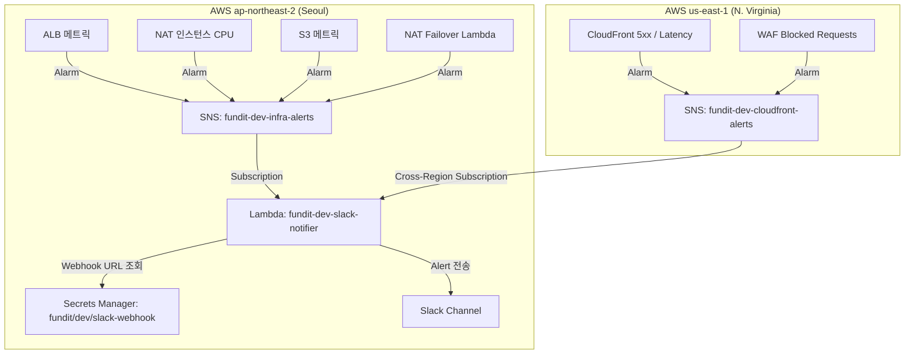

# 13-cloudwatch: 통합 모니터링 및 알람 레이어

Fundit Dev 환경의 주요 인프라 리소스(ALB, CloudFront, WAF, NAT Instance, S3, Lambda)에 대한 CloudWatch Metric Alarm 및 Slack 알림 연동 레이어입니다.

## 1. 구성 아키텍처

## 2. 프로비저닝 리소스 요약 (총 27개)
- **SNS Topics & Subscriptions**:
  - `fundit-dev-infra-alerts` (ap-northeast-2)
  - `fundit-dev-cloudfront-alerts` (us-east-1)
  - `fundit-dev-nat-failover-alerts` 구독 연동
- **Lambda Function**:
  - `fundit-dev-slack-notifier` (Python 3.12, Secrets Manager 기반 Slack Webhook 발송)
- **CloudWatch Alarms**:
  - ALB 5XX 에러 수 / 타겟 응답 시간(p95) / 타겟 비정상 호스트 수
  - CloudFront 5XX 에러율 / Origin 지연시간
  - WAF 차단 요청 수 급증
  - NAT 인스턴스 CPU 사용률 임계치
  - S3 미디어 버킷 4XX 에러 / 버킷 용량
  - NAT Failover Lambda 에러 및 실행 시간 초과

## 3. 사전 요구 사항 (Prerequisites)
- AWS Secrets Manager에 Slack Webhook Secret이 사전 생성되어 있어야 합니다.
  - 시크릿 키: `fundit/dev/slack-webhook`
  - JSON 형식: `{"webhook_url": "https://hooks.slack.com/services/..."}`
